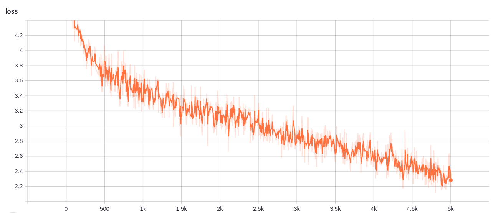

# Seq-2-Seq ChatBot in Pytorch
The repository consists of a seq2seq chatbot implemented using Pytorch. 

## Overview

I have observed an increasing use of chatbots in the last few years. The increasing trend motivated me to try and learn how do all the firms really come up with their own chatbots.
No wonder **chatbot** is a potent application of **Natural Language Ptocessing**.
I have tried to implement a chatbot on my own on the [Cornell Movie--Dialogs Corpus](https://www.cs.cornell.edu/~cristian/Cornell_Movie-Dialogs_Corpus.html) dataset using GRUs with an Attention mechanism.

## Contents
1. [Setup Instructions](#1-setup-instructions)
2. [Preparing the data](#2-preparing-the-data)
3. [Training your model from scratch](#3-training-your-model-from-scratch)
4. [Conversation with the bot](#4-conversation-with-the-bot)
5. [Repository Overview](#5-repository-overview)
6. [Observations](#6-observations)
7. [Credits](#7-credits)

## 1. Setup Instructions
You can either download the repo or clone it by running the following in cmd prompt
```
https://github.com/praeclarumjj3/Chatbot-with-Pytorch.git
```
## 2. Preparing the data

You can prepare the data for training the model (after extracting the zip file in a directory named **data**) by the following command (in google colab):
```
! python3 dataset.py --lines [NUMBER_OF_SAMPLE_LINES_TO_PRINT] --device ['cpu' or 'cuda']

```

- `lines`    - number of lines to be printed
- `device`   - set the device (cpu or cuda, default: cpu)

This will create a formatted .txt file named **formatted_movie_lines.txt** with the path `data/cornell movie-dialogs corpus/formatted_movie_lines.txt`.

## 3. Training your model from scratch

You can train the model from scratch by the following command (in google colab):
```
! python3 chatbot_train.py --attn_model [NAME_OF_ATTENTION_MODEL] --device ['cpu' or 'cuda'] --hidden_size [SIZE] --teacher_forcing_ratio [PROBABILITY] --batch_size [BATCH_SIZE] --epochs [NUMBER_OF_ITERATIONS] --lr [LEARNING_RATE]  --min_count [MIN_COUNT_FOR_WORDS] --max_length [MAX_LENGTH_OF_SENTENCE] --encoder_n_layers [NUMBER] --decoder_n_layers [NUMBER]

```
- `attn_model`              - type of attention model: (dot/general/concat)
- `device`                  - set the device (cpu or cuda, default: cpu)
- `hidden_size`             - size of the feature space (default: 500 )
- `teacher_forcing_ratio`   - probability for using the current target word as the decoder’s next input rather than using the decoder’s guess (default: 1.0)
- `batch_size`              - batch size (default: 64)
- `epochs`                  - number of iterations (default: 5000)
- `lr`                      - learning rate  (default: 0.0001)
- `min_count`               - minimum count of a word (default: 3)
- `max_length`              - maximum length of a sentence (default: 10)
- `encoder_n_layers`        - number of layers in the encoder RNN (default: 2)
- `decoder_n_layers`        - number of layers in the decoder RNN (default: 2)

This trains the model and puts the checkpoints inside a `model` folder and logs inside a `logs` folder.

## 4. Conversation with the bot

To chat with the chatbot, run the following command (in google colab):

```
! python3 chatbot_test.py  ---attn_model [NAME_OF_ATTENTION_MODEL] --device ['cpu' or 'cuda'] --hidden_size [SIZE] --checkpoint [MODEL_CHECKPOINT_TO_BE_LOADED] --min_count [MIN_COUNT_FOR_WORDS] --max_length [MAX_LENGTH_OF_SENTENCE] --encoder_n_layers [NUMBER] --decoder_n_layers [NUMBER]

```
- `attn_model`              - type of attention model: (dot/general/concat)
- `device`                  - set the device (cpu or cuda, default: cpu)
- `hidden_size`             - size of the feature space (default: 500 )
- `checkpoint`              - checkpoint for the model loading (default: 5000)
- `min_count`               - minimum count of a word (default: 3)
- `max_length`              - maximum length of a sentence (default: 10)
- `encoder_n_layers`        - number of layers in the encoder RNN (default: 2)
- `decoder_n_layers`        - number of layers in the decoder RNN (default: 2)

You can chat with the bot by typing in the sentences!

## 5. Repository Overview

The repository contains the following files

- `helpers.py` - Contains the helper functions
- `modules.py` - Contains the modules for our model
- `dataset.py` - Contains the code for formatting the dataset
- `model.txt` - Contains a link to a pre-trained model
- `README.md` - README giving an overview of the repo
- `data`      - Contains the zipped formatted data (no need to run `dataset.py` after downloading this)
- `Training.txt` - contains the loss values during the training of our VQ-VAE model 
- `logs` - Contains the zipped tensorboard logs for our VQ-VAE model (automatically created by the program)
- `sample.txt` - Contains some functions to test our defined modules

Command to run tensorboard(in google colab):

```
%load_ext tensorboard
%tensordboard --logdir logs
```

## 6. Observations

The model was trained on colab for 5000 iterations which took around 16 minutes for `max_length=10` and `min_count=3`.
I tried the model with different hyperparameters as well which didn't produce better results which explains the importance of choosing the right `max_length` and `min_count` values.
The average-loss kept on decreasing, training for more iterations should decrease it further.

  

One fascinating thing was that the bot replied with *i don't know* whenever it didn't understand the question.


## 7. Credits

I followed the [Pytorch](https://pytorch.org/tutorials/beginner/chatbot_tutorial.html) tutorial to learn and implement this chatbot.
